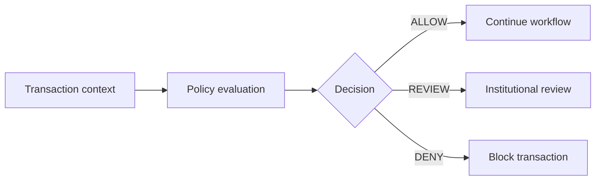

Use this page to verify that the documentation feels consistent with the Coda website across typography, color, surfaces, borders, and interactive components.

<Badge color="blue" icon="circle-check" shape="pill">
  Dark theme enabled
</Badge>

## Typography

### Institutional decision infrastructure

Coda provides the **decision layer for digital asset transactions**. It brings wallet context, institutional intelligence, and policy together before an action is approved.

This paragraph tests regular body copy, **strong emphasis**, *italic emphasis*, [inline links](https://www.codanetwork.io), and `inline code`.

> Every transaction should be explainable, enforceable, and aligned with institutional policy.

The visual hierarchy should remain clear across:

- Primary headings and section titles
- Standard paragraphs and supporting text
- Inline links and emphasized content
- Ordered and unordered lists
- Inline code and quoted content

1. Collect the transaction context.
2. Evaluate institutional policy.
3. Record the decision evidence.
4. Return an actionable outcome.

## Brand palette

<Color variant="compact">
  <Color.Item name="Primary" value="#1A66E5" />
  <Color.Item name="Primary light" value="#4684EE" />
  <Color.Item name="Primary dark" value="#1453C4" />
  <Color.Item name="Canvas" value="#04070F" />
  <Color.Item name="Surface" value="#0A0F1C" />
  <Color.Item name="Primary text" value="#EEF2F9" />
  <Color.Item name="Secondary text" value="#B9C4D6" />
</Color>

## Callouts

The following components test informational and semantic states.

<Note>
  Coda evaluates transaction context before funds are signed, credited, or otherwise acted upon.
</Note>

<Info>
  Decision evidence should include the evaluated policy version and the institutional context used at decision time.
</Info>

<Tip>
  Use deterministic policy identifiers so decisions can be traced across systems.
</Tip>

<Check>
  The transaction passed all configured authorization requirements and may proceed.
</Check>

<Warning>
  The transaction requires additional institutional review before execution.
</Warning>

<Danger>
  The transaction violates an enforced policy and must not proceed.
</Danger>

<Callout icon="shield" color="#1A66E5">
  This custom callout uses the Coda primary brand color.
</Callout>

## Status badges

These badges test compact brand and semantic indicators.

<Badge color="blue" icon="circle-info">Policy evaluated</Badge>
<Badge color="green" icon="circle-check">ALLOW</Badge>
<Badge color="orange" icon="clock">REVIEW</Badge>
<Badge color="red" icon="ban">DENY</Badge>
<Badge color="gray" icon="lock">Pending</Badge>

### Badge variations

<Badge stroke color="blue">Brand</Badge>
<Badge stroke color="green">Approved</Badge>
<Badge stroke color="orange">Requires review</Badge>
<Badge stroke color="red">Blocked</Badge>

## Cards and surfaces

<Columns cols={2}>
  <Card title="Decision engine" icon="gear" color="#4684EE" href="#decision-workflow">
    Evaluate wallet context, institutional intelligence, and policy before authorizing an action.
  </Card>

  <Card title="Policy controls" icon="lock" color="#4684EE">
    Configure deterministic controls that reflect institutional requirements.
  </Card>

  <Card title="Decision evidence" icon="book" color="#4684EE">
    Record the policy version, evaluated signals, and final outcome for every decision.
  </Card>

  <Card title="Developer integration" icon="code" color="#4684EE" href="#code-examples">
    Integrate Coda into existing transaction and signing workflows.
  </Card>
</Columns>

<Card title="Coda" icon="arrow-up-right-from-square" color="#4684EE" href="https://www.codanetwork.io" horizontal arrow cta="Visit website">
  Explore the institutional decision layer for digital asset transactions.
</Card>

## Decision workflow

<Steps>
  <Step title="Submit transaction context">
    Provide the wallet, asset, amount, destination, and institutional customer context.
  </Step>

  <Step title="Evaluate intelligence">
    Coda collects configured intelligence from institutional and external systems.
  </Step>

  <Step title="Apply policy">
    The decision engine evaluates the transaction against the active institutional policy.
  </Step>

  <Step title="Return a decision">
    Coda returns `ALLOW`, `REVIEW`, or `DENY` with structured decision evidence.
  </Step>
</Steps>

## Decision outcomes

<Tabs>
  <Tab title="ALLOW" icon="circle-check">
    The transaction satisfies all configured authorization requirements and may proceed.

    ```json ALLOW response
    {
      "decision": "ALLOW",
      "policyVersion": "12",
      "evidenceRecorded": true
    }
    ```
  </Tab>

  <Tab title="REVIEW" icon="clock">
    The transaction requires additional institutional approval or investigation.

    ```json REVIEW response
    {
      "decision": "REVIEW",
      "policyVersion": "12",
      "reason": "Manual approval required"
    }
    ```
  </Tab>

  <Tab title="DENY" icon="ban">
    The transaction violates an enforced policy and must be blocked.

    ```json DENY response
    {
      "decision": "DENY",
      "policyVersion": "12",
      "reason": "Destination policy violation"
    }
    ```
  </Tab>
</Tabs>

## Code examples

<CodeGroup>

```bash cURL
curl --request POST \
  --url https://api.codanetwork.io/v1/decisions \
  --header "Authorization: Bearer $CODA_API_KEY" \
  --header "Content-Type: application/json" \
  --data '{
    "asset": "USDC",
    "amount": "1402887.50",
    "destination": "0x8f3a...d4f5"
  }'
```

```typescript TypeScript
const response = await fetch(
  "https://api.codanetwork.io/v1/decisions",
  {
    method: "POST",
    headers: {
      Authorization: `Bearer ${process.env.CODA_API_KEY}`,
      "Content-Type": "application/json",
    },
    body: JSON.stringify({
      asset: "USDC",
      amount: "1402887.50",
      destination: "0x8f3a...d4f5",
    }),
  },
);

const decision = await response.json();
```

```python Python
import os

import requests

response = requests.post(
    "https://api.codanetwork.io/v1/decisions",
    headers={
        "Authorization": f"Bearer {os.environ['CODA_API_KEY']}",
        "Content-Type": "application/json",
    },
    json={
        "asset": "USDC",
        "amount": "1402887.50",
        "destination": "0x8f3a...d4f5",
    },
)

decision = response.json()
```

</CodeGroup>

### Highlighted code

```typescript decision-handler.ts {6-8} lines
type Decision = "ALLOW" | "REVIEW" | "DENY";

export function handleDecision(decision: Decision) {
  switch (decision) {
    case "ALLOW":
      return continueSigningWorkflow();
    case "REVIEW":
      return openInstitutionalReview();
    case "DENY":
      return blockTransaction();
  }
}
```

## Decision path



## Data table

| Outcome | Meaning | Required action |
| --- | --- | --- |
| `ALLOW` | All authorization requirements passed | Continue the transaction workflow |
| `REVIEW` | Additional approval is required | Hold the transaction for review |
| `DENY` | An enforced policy was violated | Block the transaction |
| `PENDING` | Evaluation is still in progress | Wait for the final decision |

## API fields

<ParamField body="asset" type="string" required>
  The asset identifier used by the transaction, such as `USDC`.
</ParamField>

<ParamField body="amount" type="string" required>
  The transaction amount represented as a decimal string.
</ParamField>

<ParamField body="destination" type="string" required>
  The destination wallet address.
</ParamField>

<ResponseField name="decision" type="ALLOW | REVIEW | DENY" required>
  The authorization outcome returned by the decision engine.
</ResponseField>

<ResponseField name="policyVersion" type="string" required>
  The institutional policy version used during evaluation.
</ResponseField>

<ResponseField name="evidenceRecorded" type="boolean" required>
  Indicates whether structured decision evidence was recorded.
</ResponseField>

## Accordions

<AccordionGroup>
  <Accordion title="What should an ALLOW decision look like?" icon="circle-check">
    ALLOW should use a controlled success treatment. It must remain visually distinct from the primary Coda brand blue.
  </Accordion>

  <Accordion title="When should REVIEW be used?" icon="clock">
    REVIEW should indicate that the transaction is paused pending institutional approval or investigation.
  </Accordion>

  <Accordion title="What does DENY mean?" icon="ban">
    DENY represents an enforced block. It should use a clear danger treatment without overwhelming surrounding content.
  </Accordion>

  <Accordion title="How should decision evidence appear?" icon="file">
    Evidence should use structured fields, readable code blocks, and restrained borders that match the dark institutional interface.
  </Accordion>
</AccordionGroup>

## Tooltip

A <Tooltip headline="Decision evidence" tip="The structured record of evaluated context, policy, and outcome.">decision evidence record</Tooltip> should make every authorization outcome explainable.

## Visual review checklist

- The page background uses the deep Coda canvas color rather than pure black.
- Primary links, active states, and navigation accents use Coda blue.
- Cards use restrained borders and subtle surface separation.
- Headings remain clear without appearing excessively bright.
- Body text is readable but visually quieter than headings.
- Inline code remains legible against the surrounding surface.
- Focus, hover, and selected states are visible.
- Mobile layouts preserve spacing and hierarchy.
- `ALLOW`, `REVIEW`, and `DENY` remain semantically distinguishable.
